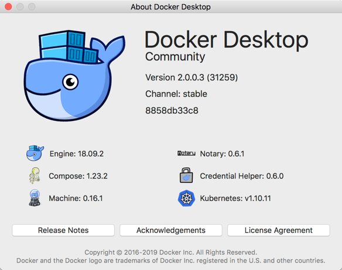
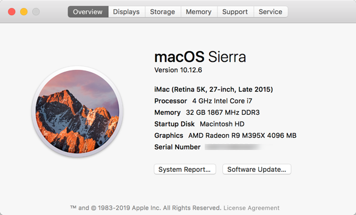

## NetDevOps
#### 2019-03-02 claudia@indigowire.net

## Cosmic Cuttlefish Ansible Heartbreaker Dockerfile
 - Latest Ubuntu LTS 18 Cosmic Cuttlefish
 	* 18.10, cosmic-20190131, cosmic, rolling (cosmic/Dockerfile)
 - Python 2.7, Python 3.6, Ansible 2.6, Nornir 2.0
 - [Ansible 2.6 Heartbreaker](https://github.com/ansible/ansible/blob/stable-2.6/changelogs/CHANGELOG-v2.6.rst)
  


[cldeluna/cosmic-heartbreaker image](https://hub.docker.com/r/cldeluna/cosmic-heartbreaker) 
  
------


Purpose built ansible image starting with Ubuntu:18.10 Cosmic Cuttlefish base and including:
- Python 2.7 (Legacy)
- Python 3.6
- ansible 2.6
- git
- yaml
- jinja2
- tree
- nano
- vim
- wget
- traceroute
- iputils-ping
- snmp
- snmp-mibs-downloader

Python Modules:
- nornir
- textfms
- netmiko
- ciscoconfparse
- argparse 
- requests
- xlrd
- openpyxl

Repositories:
- https://github.com/cldeluna/ansible2_4_base.git
- https://github.com/cldeluna/cisco_aci.git
- https://github.com/cldeluna/cisco_ios.git


## Build

```
Claudias-iMac:cosmic-heartbreaker claudia$ tree
.
├── Dockerfile
└── README.md

0 directories, 2 files
```

```
Claudias-iMac:cosmic-heartbreaker claudia$ docker build -t cldeluna/cosmic-heartbreaker .
```

## Run

Run interactively and map a local directory /Users/claudia/Documents/docker_volume to the /ansible directory in the container.
```
Claudias-iMac:cosmic-heartbreaker claudia$ docker run -v  /Users/claudia/Documents/docker_volume:/ansible -it cldeluna/cosmic-heartbreaker
```

## Docker Hub

```
Claudias-iMac:cosmic-heartbreaker claudia$ docker tag cldeluna/cosmic-heartbreaker:latest cldeluna/cosmic-heartbreak:latest
Claudias-iMac:cosmic-heartbreaker claudia$ docker push cldeluna/cosmic-heartbreaker
```

## Environment





