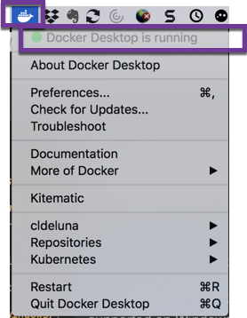

# Using Docker Cheatsheet

This "Quick Start" cheatsheet it intended to get you up and running quickly with the various ansible containers.

The following Docker images are available on [Docker Hub](https://hub.docker.com/)

[cldeluna Docker Images](https://hub.docker.com/u/cldeluna)

- [Disco Immigrant (Ubuntu 19.04 Disco Dingo) and Ansible 2.9 Immigrant Song](https://hub.docker.com/r/cldeluna/disco-immigrant)
- [Cosmic More Time (Ubuntu 18.10 Cosmic Cuttlefish) and Ansible 2.8 More Time](https://hub.docker.com/r/cldeluna/cosmic-moretimes)
- [Cosmic Light (Ubuntu 18.10 Cosmic Cuttlefish) and Ansible 2.7 In the Light](https://hub.docker.com/r/cldeluna/cosmic-light)
- [Cosmic Hearthbreaker (Ubuntu 18.10 Cosmic Cuttlefish) and Ansible 2.6 Heartbreaker](https://hub.docker.com/r/cldeluna/cosmic-heartbreaker)
- [Xenial Ansible (Ubuntu 16.04Xenial Xerus) and Ansible 2.4](https://hub.docker.com/r/cldeluna/xenial-ansible)
- [Trusty Ansible (Ubuntu 14.04 Trusty Tahr) and Ansible 2.2](https://hub.docker.com/r/cldeluna/trusty-ansible)


### Installing Docker

[Installing Docker Desktop on Mac](https://docs.docker.com/docker-for-mac/install/)

[Installing Docker Desktop on Windows](https://docs.docker.com/docker-for-windows/install/)
WARNING: The Docker Desktop application is only supported on Windows 10 64-bit and requires Hyper-V and the Containers Window features to be enabled.


This means that other Virtualization software that does not support HyperV will no longer work (i.e. VNware Workstation and VirtualBox)

If you have existing Virtualization software installed and which you use, Docker Toolbox for Windows is still available.

[Docker Toolbox on Windows](https://docs.docker.com/toolbox/toolbox_install_windows/)

[Toolbox Releases](https://github.com/docker/toolbox/releases)


### Getting Started on Mac with Docker Desktop

#### Summary of Steps

1. Make sure Docker Desktop is installed and running
2. Open a terminal window and launch your container
3. Look around the ready built repositories which are cloned in the container to get you started quickly.  

#### Details

1. Make sure that Docker is installed and running on your Mac.




2. Open a terminal window and use the **docker run -it** command to start the container on your Mac.

Full command to start an interactive session
***docker run -it cldeluna/disco-immigrant*** 

The first time you execute this command, the docker image will download and then put you into an interacive bash shell in the container.
This will basically take over your terminal window so if you need to do something else on your system open up a different terminal window.

Once the download is complete and the container is running you will notice that the prompt in your terminal window has changed.

It will look something like "root@c421cab61f1f:/ansible_local". 


```
Claudias-iMac:disco-immigrant claudia$ docker run -it cldeluna/disco-immigrant
root@c421cab61f1f:/ansible_local#
```

3. Several repositories are cloned into the container to get you started quickly.  Using the **ls** command will give  you a listing of the directories.

If you **cd** or change directory into the cisco_ios directory you can get started with some basic Playbooks.


```
Claudias-iMac:disco-immigrant claudia$ docker run -it cldeluna/disco-immigrant
root@c421cab61f1f:/ansible_local#
root@c421cab61f1f:/ansible_local# ls
ansible2_4_base  cisco_aci  cisco_ios
root@c421cab61f1f:/ansible_local# cd cisco_ios
root@c421cab61f1f:/ansible_local/cisco_ios# ls
ansible.cfg     ios_all_vrf_arp.yml   ios_show_cmdlist_zip.yml  logs
filter_plugins  ios_facts_lab.yml     ios_show_lab.yml          nxos_facts_lab.yml
group_vars      ios_facts_report.yml  ios_show_lab25.yml        nxos_show_cmdlist.yml
hosts           ios_show_cmdlist.yml  ios_show_lab_brief.yml    templates
root@c421cab61f1f:/ansible_local/cisco_ios# vi
```


### Getting Started on Windows


#### Summary of Steps

1. Make sure Docker Desktop is installed and running
2. Open a terminal window and launch your container
3. Look around the ready built repositories which are cloned in the container to get you started quickly.  

#### Details


###  Execute one of the ready built Playbooks

#### Summary of Steps

1. Exeute a **git pull** to make sure the repository has the latest code
2. Try one of the ready made Playbooks
3. Take one of the example playbooks and modify it to suit your needs or create a new Playbook.

#### Details

1. Before you try any of the playbooks, its a good idea to execute a **git pull** so that you have the latest version of the repository.

Example of updated repository:

```git
root@c421cab61f1f:/ansible_local/cisco_ios# git pull
remote: Enumerating objects: 5, done.
remote: Counting objects: 100% (5/5), done.
remote: Compressing objects: 100% (1/1), done.
remote: Total 3 (delta 2), reused 3 (delta 2), pack-reused 0
Unpacking objects: 100% (3/3), done.
From https://github.com/cldeluna/cisco_ios
   275f642..a8f951f  master     -> origin/master
Updating 275f642..a8f951f
Fast-forward
 ios_show_lab_brief.yml | 2 +-
 1 file changed, 1 insertion(+), 1 deletion(-)
root@c421cab61f1f:/ansible_local/cisco_ios#

```


Example of repository already up to date:

```git
root@c421cab61f1f:/ansible_local/cisco_ios# git pull
Already up to date.
root@c421cab61f1f:/ansible_local/cisco_ios#
```

2. Execute the ios_show_lab_brief.yml Playbook.

The comments in the playbook explain what its doing and how to execute it.

```bash
root@c421cab61f1f:/ansible_local/cisco_ios# ansible-playbook -i hosts ios_show_lab_brief.yml
```

You will see that the playbook saves different types of output into different text files.
**cd** to the logs directory and review the results.

```bash
root@c421cab61f1f:/ansible_local/cisco_ios# cd logs
root@c421cab61f1f:/ansible_local/cisco_ios/logs# tree
.
|-- ios-xe-mgmt.cisco.com-config.txt
|-- ios-xe-mgmt.cisco.com-raw-output.txt
|-- ios-xe-mgmt.cisco.com-readable-show-output.txt
`-- output_directory

0 directories, 4 files
```

3.  At this point, you can start making these playbooks your own.

Update the hosts file and create your own group of devices.  Update the show commands.  Start your own Playbook now that you have an Ansible Control server you are ready to go!

Since this is a container, it will leverage your systems network connection so if you VPN into your lab for example, you can use Control Server on your system.


#### Full output of ios_show_lab_brief.yml Playbook Execution

```bash
root@c421cab61f1f:/ansible_local/cisco_ios# 
root@c421cab61f1f:/ansible_local/cisco_ios# ansible-playbook -i hosts ios_show_lab_brief.yml

PLAY [Pull show commands form Cisco IOS_XE Always On Sandbox device] *************************************

TASK [Iterate over show commands] ************************************************************************
ok: [ios-xe-mgmt.cisco.com] => (item=show run)
ok: [ios-xe-mgmt.cisco.com] => (item=show version)
ok: [ios-xe-mgmt.cisco.com] => (item=show inventory)
ok: [ios-xe-mgmt.cisco.com] => (item=show ip int br)
ok: [ios-xe-mgmt.cisco.com] => (item=show ip route)

TASK [debug] *********************************************************************************************
ok: [ios-xe-mgmt.cisco.com] => {
    "output": {
        "changed": false,
        "deprecations": [
            {
                "msg": "Distribution Ubuntu 19.04 on host ios-xe-mgmt.cisco.com should use /usr/bin/python3, but is using /usr/bin/python for backward compatibility with prior Ansible releases. A future Ansible release will default to using the discovered platform python for this host. See https://docs.ansible.com/ansible/2.9/reference_appendices/interpreter_discovery.html for more information",
                "version": "2.12"
            }
        ],
        "msg": "All items completed",
        "results": [
            {
                "ansible_facts": {
                    "discovered_interpreter_python": "/usr/bin/python"
                },
                "ansible_loop_var": "item",
                "changed": false,
                "failed": false,
                "invocation": {
                    "module_args": {
                        "auth_pass": null,
                        "authorize": null,
                        "commands": [
                            "show run"
                        ],
                        "host": null,
                        "interval": 1,
                        "match": "all",
                        "password": null,
                        "port": null,
                        "provider": null,
                        "retries": 10,
                        "ssh_keyfile": null,
                        "timeout": null,
                        "username": null,
                        "wait_for": null
                    }
                },
                "item": "show run",
                "stdout": [
                    "Building configuration...\n\nCurrent configuration : 6228 bytes\n!\n! Last configuration change at 23:15:26 UTC Sat Nov 23 2019 by root\n!\nversion 16.9\nservice timestamps debug datetime msec\nservice timestamps log datetime msec\nplatform qfp utilization monitor load 80\nno platform punt-keepalive disable-kernel-core\nplatform console virtual\n!\nhostname csr1000v\n!\nboot-start-marker\nboot-end-marker\n!\n!\nno logging console\nenable secret 5 $1$gkJ1$EofN9ajW9k18SoRTgkhYr/\n!\nno aaa new-model\n!\n!\n!\n!\n!\n!\n!\nip domain name abc.inc\n!\n!\n!\nlogin on-success log\n!\n!\n!\n!\n!\n!\n!\nsubscriber templating\n! \n! \n! \n! \n!\nmultilink bundle-name authenticated\n!\n!\n!\n!\n!\ncrypto pki trustpoint TP-self-signed-1530096085\n enrollment selfsigned\n subject-name cn=IOS-Self-Signed-Certificate-1530096085\n revocation-check none\n rsakeypair TP-self-signed-1530096085\n!\n!\ncrypto pki certificate chain TP-self-signed-1530096085\n certificate self-signed 01\n  30820330 30820218 A0030201 02020101 300D0609 2A864886 F70D0101 05050030 \n  31312F30 2D060355 04031326 494F532D 53656C66 2D536967 6E65642D 43657274 \n  69666963 6174652D 31353330 30393630 3835301E 170D3139 30353135 31353230 \n  34305A17 0D333030 31303130 30303030 305A3031 312F302D 06035504 03132649 \n  4F532D53 656C662D 5369676E 65642D43 65727469 66696361 74652D31 35333030 \n  39363038 35308201 22300D06 092A8648 86F70D01 01010500 0382010F 00308201 \n  0A028201 0100B239 1ADC578A 8FD99454 BC1BE3E4 38E9CF35 D1D2420E 53D62D27 \n  92220CF4 A1AD3126 76B809F0 F227D539 3E371330 8C7767EA 2F22A811 7CA7B88F \n  26EE73B8 9925DAFF E2453823 BCF29423 DACB3CE9 92238E44 18E1834F A6D8ABCA \n  C6B686E5 ACD87A90 AF9EAE89 093BBEDC 1E2E2AEE 989C4B8C 7D53DBE4 57AE8D66 \n  2424721F 3C66A5AC 24A77372 EC6691CE 61B8DF71 A327F668 A9C76D2D EE364206 \n  2713286B 7127CB29 57010489 D350BC1B E19C548E D63B0609 3FB63FFE DAD9CBAE \n  26A60DB8 A2C51F1D B75577DF 4CA4879C A36E545F C221760D E1308E74 35399E91 \n  8A7075CD 498E7439 BBFC72A7 9217389D 8C1787FF 5AC1ECCA 36D9AE5C 8564AD06 \n  4CD176B2 EB690203 010001A3 53305130 0F060355 1D130101 FF040530 030101FF \n  301F0603 551D2304 18301680 142A4179 9A2DB89D 21F5780E A6170B83 D01CF664 \n  17301D06 03551D0E 04160414 2A41799A 2DB89D21 F5780EA6 170B83D0 1CF66417 \n  300D0609 2A864886 F70D0101 05050003 82010100 5469C02A ACD746F5 FAA7ADD6 \n  53BF195C B0FE9815 EC401671 0FDB9C8A 91571EA0 0F1748BA BA7DEFEE 41889B7B \n  58F280B7 6FD9D433 B53E5EA4 860014A6 01408E1C 12212B34 499CFC91 9AD075B8 \n  7300AF75 A836A2A4 588B4B91 2E72DF0D DA9EA3CD 7CE8D3E3 4990A6D5 5F46634A \n  5518C7C1 34B5B5D7 44EAF2A8 0DFB4762 4F2450BE D3D0D5E3 F026015D DFF04762 \n  AA3E3332 07FEF910 D895D4D8 D673E2DB D7534719 F86C0BA8 ACAB3057 6E50A289 \n  4D1EB2F9 9D24EA20 B0ADA198 037450F4 C606864A A6C7C060 5099D394 FF68F570 \n  4D9F84E6 2B1238B9 32D7FABB F9632EA7 BA8597E8 63802AD9 B92187DF 53935107 \n  5B6C962B 805A8031 F268C32C B1338EAB 3E9A2958\n  \tquit\n!\n!\n!\n!\n!\n!\n!\n!\nlicense udi pid CSR1000V sn 9ZL30UN51R9\nlicense boot level ax\nno license smart enable\ndiagnostic bootup level minimal\n!\nspanning-tree extend system-id\n!\nnetconf-yang\n!\nrestconf\n!\nusername developer privilege 15 secret 5 $1$HtLC$7Kj3hGBoDnSHzdEeR/2ix.\nusername cisco privilege 15 secret 5 $1$aO1Y$0AFVz00ON.hE4WkY.BeYq.\nusername root privilege 15 secret 5 $1$vpY7$mh9d69ui3koSaITBi8k9D/\n!\nredundancy\n!\n!\n!\n!\n!\n!\n! \n!\n!\n!\n!\n!\n!\n!\n!\n!\n!\n!\n!\n! \n! \n!\n!\ninterface Loopback18\n description Configured by RESTCONF\n ip address 172.16.100.18 255.255.255.0\n!\ninterface Loopback702\n description Configured by charlotte\n ip address 172.17.2.1 255.255.255.0\n!\ninterface Loopback710\n description Configured by seb\n ip address 172.17.10.1 255.255.255.0\n!\ninterface Loopback2101\n description Configured by RESTCONF\n ip address 172.20.1.1 255.255.255.0\n!\ninterface Loopback2102\n description Configured by Charlotte\n ip address 172.20.2.1 255.255.255.0\n!\ninterface Loopback2103\n description Configured by OWEN\n ip address 172.20.3.1 255.255.255.0\n!\ninterface Loopback2104\n description Configured by RESTCONF\n ip address 172.20.4.1 255.255.255.0\n!\ninterface Loopback2105\n description Configured by RESTCONF\n ip address 172.20.5.1 255.255.255.0\n!\ninterface Loopback2107\n description Configured by Josia\n ip address 172.20.7.1 255.255.255.0\n!\ninterface Loopback2108\n description Configured by RESTCONF\n ip address 172.20.8.1 255.255.255.0\n!\ninterface Loopback2109\n description Configured by RESTCONF\n ip address 172.20.9.1 255.255.255.0\n!\ninterface Loopback2111\n description Configured by RESTCONF\n ip address 172.20.11.1 255.255.255.0\n!\ninterface Loopback2112\n description Configured by RESTCONF\n ip address 172.20.12.1 255.255.255.0\n!\ninterface Loopback2113\n description Configured by RESTCONF\n ip address 172.20.13.1 255.255.255.0\n!\ninterface Loopback2114\n description Configured by RESTCONF\n ip address 172.20.14.1 255.255.255.0\n!\ninterface Loopback2116\n description Configured by RESTCONF\n ip address 172.20.16.1 255.255.255.0\n!\ninterface Loopback2117\n description Configured by RESTCONF\n ip address 172.20.17.1 255.255.255.0\n!\ninterface Loopback2119\n description Configured by RESTCONF\n ip address 172.20.19.19 255.255.255.0\n!\ninterface Loopback2121\n description Configured by RESTCONF\n ip address 172.20.21.1 255.255.255.0\n!\ninterface Loopback3115\n description Configured by Breuvage\n ip address 172.20.15.1 255.255.255.0\n!\ninterface GigabitEthernet1\n description MANAGEMENT INTERFACE - DON'T TOUCH ME\n ip address 10.10.20.48 255.255.255.0\n negotiation auto\n no mop enabled\n no mop sysid\n!\ninterface GigabitEthernet2\n description Configured by RESTCONF\n ip address 10.255.255.1 255.255.255.0\n negotiation auto\n no mop enabled\n no mop sysid\n!\ninterface GigabitEthernet3\n description Network Interface\n no ip address\n shutdown\n negotiation auto\n no mop enabled\n no mop sysid\n!\nip forward-protocol nd\nip http server\nip http authentication local\nip http secure-server\nip route 0.0.0.0 0.0.0.0 GigabitEthernet1 10.10.20.254\n!\nip ssh rsa keypair-name ssh-key\nip ssh version 2\nip scp server enable\n!\n!\n!\n!\n!\ncontrol-plane\n!\n!\n!\n!\n!\nbanner motd ^C\nWelcome to the DevNet Sandbox for CSR1000v and IOS XE\n\nThe following programmability features are already enabled:\n  - NETCONF\n  - RESTCONF\n\nThanks for stopping by.\n^C\n!\nline con 0\n exec-timeout 0 0\n stopbits 1\nline vty 0 4\n login local\n transport input ssh\n!\nntp logging\nntp authenticate\n!\n!\n!\n!\n!\nend"
                ],
                "stdout_lines": [
                    [
                        "Building configuration...",
                        "",
                        "Current configuration : 6228 bytes",
                        "!",
                        "! Last configuration change at 23:15:26 UTC Sat Nov 23 2019 by root",
                        "!",
                        "version 16.9",
                        "service timestamps debug datetime msec",
                        "service timestamps log datetime msec",
                        "platform qfp utilization monitor load 80",
                        "no platform punt-keepalive disable-kernel-core",
                        "platform console virtual",
                        "!",
                        "hostname csr1000v",
                        "!",
                        "boot-start-marker",
                        "boot-end-marker",
                        "!",
                        "!",
                        "no logging console",
                        "enable secret 5 $1$gkJ1$EofN9ajW9k18SoRTgkhYr/",
                        "!",
                        "no aaa new-model",
                        "!",
                        "!",
                        "!",
                        "!",
                        "!",
                        "!",
                        "!",
                        "ip domain name abc.inc",
                        "!",
                        "!",
                        "!",
                        "login on-success log",
                        "!",
                        "!",
                        "!",
                        "!",
                        "!",
                        "!",
                        "!",
                        "subscriber templating",
                        "! ",
                        "! ",
                        "! ",
                        "! ",
                        "!",
                        "multilink bundle-name authenticated",
                        "!",
                        "!",
                        "!",
                        "!",
                        "!",
                        "crypto pki trustpoint TP-self-signed-1530096085",
                        " enrollment selfsigned",
                        " subject-name cn=IOS-Self-Signed-Certificate-1530096085",
                        " revocation-check none",
                        " rsakeypair TP-self-signed-1530096085",
                        "!",
                        "!",
                        "crypto pki certificate chain TP-self-signed-1530096085",
                        " certificate self-signed 01",
                        "  30820330 30820218 A0030201 02020101 300D0609 2A864886 F70D0101 05050030 ",
                        "  31312F30 2D060355 04031326 494F532D 53656C66 2D536967 6E65642D 43657274 ",
                        "  69666963 6174652D 31353330 30393630 3835301E 170D3139 30353135 31353230 ",
                        "  34305A17 0D333030 31303130 30303030 305A3031 312F302D 06035504 03132649 ",
                        "  4F532D53 656C662D 5369676E 65642D43 65727469 66696361 74652D31 35333030 ",
                        "  39363038 35308201 22300D06 092A8648 86F70D01 01010500 0382010F 00308201 ",
                        "  0A028201 0100B239 1ADC578A 8FD99454 BC1BE3E4 38E9CF35 D1D2420E 53D62D27 ",
                        "  92220CF4 A1AD3126 76B809F0 F227D539 3E371330 8C7767EA 2F22A811 7CA7B88F ",
                        "  26EE73B8 9925DAFF E2453823 BCF29423 DACB3CE9 92238E44 18E1834F A6D8ABCA ",
                        "  C6B686E5 ACD87A90 AF9EAE89 093BBEDC 1E2E2AEE 989C4B8C 7D53DBE4 57AE8D66 ",
                        "  2424721F 3C66A5AC 24A77372 EC6691CE 61B8DF71 A327F668 A9C76D2D EE364206 ",
                        "  2713286B 7127CB29 57010489 D350BC1B E19C548E D63B0609 3FB63FFE DAD9CBAE ",
                        "  26A60DB8 A2C51F1D B75577DF 4CA4879C A36E545F C221760D E1308E74 35399E91 ",
                        "  8A7075CD 498E7439 BBFC72A7 9217389D 8C1787FF 5AC1ECCA 36D9AE5C 8564AD06 ",
                        "  4CD176B2 EB690203 010001A3 53305130 0F060355 1D130101 FF040530 030101FF ",
                        "  301F0603 551D2304 18301680 142A4179 9A2DB89D 21F5780E A6170B83 D01CF664 ",
                        "  17301D06 03551D0E 04160414 2A41799A 2DB89D21 F5780EA6 170B83D0 1CF66417 ",
                        "  300D0609 2A864886 F70D0101 05050003 82010100 5469C02A ACD746F5 FAA7ADD6 ",
                        "  53BF195C B0FE9815 EC401671 0FDB9C8A 91571EA0 0F1748BA BA7DEFEE 41889B7B ",
                        "  58F280B7 6FD9D433 B53E5EA4 860014A6 01408E1C 12212B34 499CFC91 9AD075B8 ",
                        "  7300AF75 A836A2A4 588B4B91 2E72DF0D DA9EA3CD 7CE8D3E3 4990A6D5 5F46634A ",
                        "  5518C7C1 34B5B5D7 44EAF2A8 0DFB4762 4F2450BE D3D0D5E3 F026015D DFF04762 ",
                        "  AA3E3332 07FEF910 D895D4D8 D673E2DB D7534719 F86C0BA8 ACAB3057 6E50A289 ",
                        "  4D1EB2F9 9D24EA20 B0ADA198 037450F4 C606864A A6C7C060 5099D394 FF68F570 ",
                        "  4D9F84E6 2B1238B9 32D7FABB F9632EA7 BA8597E8 63802AD9 B92187DF 53935107 ",
                        "  5B6C962B 805A8031 F268C32C B1338EAB 3E9A2958",
                        "  \tquit",
                        "!",
                        "!",
                        "!",
                        "!",
                        "!",
                        "!",
                        "!",
                        "!",
                        "license udi pid CSR1000V sn 9ZL30UN51R9",
                        "license boot level ax",
                        "no license smart enable",
                        "diagnostic bootup level minimal",
                        "!",
                        "spanning-tree extend system-id",
                        "!",
                        "netconf-yang",
                        "!",
                        "restconf",
                        "!",
                        "username developer privilege 15 secret 5 $1$HtLC$7Kj3hGBoDnSHzdEeR/2ix.",
                        "username cisco privilege 15 secret 5 $1$aO1Y$0AFVz00ON.hE4WkY.BeYq.",
                        "username root privilege 15 secret 5 $1$vpY7$mh9d69ui3koSaITBi8k9D/",
                        "!",
                        "redundancy",
                        "!",
                        "!",
                        "!",
                        "!",
                        "!",
                        "!",
                        "! ",
                        "!",
                        "!",
                        "!",
                        "!",
                        "!",
                        "!",
                        "!",
                        "!",
                        "!",
                        "!",
                        "!",
                        "!",
                        "! ",
                        "! ",
                        "!",
                        "!",
                        "interface Loopback18",
                        " description Configured by RESTCONF",
                        " ip address 172.16.100.18 255.255.255.0",
                        "!",
                        "interface Loopback702",
                        " description Configured by charlotte",
                        " ip address 172.17.2.1 255.255.255.0",
                        "!",
                        "interface Loopback710",
                        " description Configured by seb",
                        " ip address 172.17.10.1 255.255.255.0",
                        "!",
                        "interface Loopback2101",
                        " description Configured by RESTCONF",
                        " ip address 172.20.1.1 255.255.255.0",
                        "!",
                        "interface Loopback2102",
                        " description Configured by Charlotte",
                        " ip address 172.20.2.1 255.255.255.0",
                        "!",
                        "interface Loopback2103",
                        " description Configured by OWEN",
                        " ip address 172.20.3.1 255.255.255.0",
                        "!",
                        "interface Loopback2104",
                        " description Configured by RESTCONF",
                        " ip address 172.20.4.1 255.255.255.0",
                        "!",
                        "interface Loopback2105",
                        " description Configured by RESTCONF",
                        " ip address 172.20.5.1 255.255.255.0",
                        "!",
                        "interface Loopback2107",
                        " description Configured by Josia",
                        " ip address 172.20.7.1 255.255.255.0",
                        "!",
                        "interface Loopback2108",
                        " description Configured by RESTCONF",
                        " ip address 172.20.8.1 255.255.255.0",
                        "!",
                        "interface Loopback2109",
                        " description Configured by RESTCONF",
                        " ip address 172.20.9.1 255.255.255.0",
                        "!",
                        "interface Loopback2111",
                        " description Configured by RESTCONF",
                        " ip address 172.20.11.1 255.255.255.0",
                        "!",
                        "interface Loopback2112",
                        " description Configured by RESTCONF",
                        " ip address 172.20.12.1 255.255.255.0",
                        "!",
                        "interface Loopback2113",
                        " description Configured by RESTCONF",
                        " ip address 172.20.13.1 255.255.255.0",
                        "!",
                        "interface Loopback2114",
                        " description Configured by RESTCONF",
                        " ip address 172.20.14.1 255.255.255.0",
                        "!",
                        "interface Loopback2116",
                        " description Configured by RESTCONF",
                        " ip address 172.20.16.1 255.255.255.0",
                        "!",
                        "interface Loopback2117",
                        " description Configured by RESTCONF",
                        " ip address 172.20.17.1 255.255.255.0",
                        "!",
                        "interface Loopback2119",
                        " description Configured by RESTCONF",
                        " ip address 172.20.19.19 255.255.255.0",
                        "!",
                        "interface Loopback2121",
                        " description Configured by RESTCONF",
                        " ip address 172.20.21.1 255.255.255.0",
                        "!",
                        "interface Loopback3115",
                        " description Configured by Breuvage",
                        " ip address 172.20.15.1 255.255.255.0",
                        "!",
                        "interface GigabitEthernet1",
                        " description MANAGEMENT INTERFACE - DON'T TOUCH ME",
                        " ip address 10.10.20.48 255.255.255.0",
                        " negotiation auto",
                        " no mop enabled",
                        " no mop sysid",
                        "!",
                        "interface GigabitEthernet2",
                        " description Configured by RESTCONF",
                        " ip address 10.255.255.1 255.255.255.0",
                        " negotiation auto",
                        " no mop enabled",
                        " no mop sysid",
                        "!",
                        "interface GigabitEthernet3",
                        " description Network Interface",
                        " no ip address",
                        " shutdown",
                        " negotiation auto",
                        " no mop enabled",
                        " no mop sysid",
                        "!",
                        "ip forward-protocol nd",
                        "ip http server",
                        "ip http authentication local",
                        "ip http secure-server",
                        "ip route 0.0.0.0 0.0.0.0 GigabitEthernet1 10.10.20.254",
                        "!",
                        "ip ssh rsa keypair-name ssh-key",
                        "ip ssh version 2",
                        "ip scp server enable",
                        "!",
                        "!",
                        "!",
                        "!",
                        "!",
                        "control-plane",
                        "!",
                        "!",
                        "!",
                        "!",
                        "!",
                        "banner motd ^C",
                        "Welcome to the DevNet Sandbox for CSR1000v and IOS XE",
                        "",
                        "The following programmability features are already enabled:",
                        "  - NETCONF",
                        "  - RESTCONF",
                        "",
                        "Thanks for stopping by.",
                        "^C",
                        "!",
                        "line con 0",
                        " exec-timeout 0 0",
                        " stopbits 1",
                        "line vty 0 4",
                        " login local",
                        " transport input ssh",
                        "!",
                        "ntp logging",
                        "ntp authenticate",
                        "!",
                        "!",
                        "!",
                        "!",
                        "!",
                        "end"
                    ]
                ]
            },
            {
                "ansible_loop_var": "item",
                "changed": false,
                "failed": false,
                "invocation": {
                    "module_args": {
                        "auth_pass": null,
                        "authorize": null,
                        "commands": [
                            "show version"
                        ],
                        "host": null,
                        "interval": 1,
                        "match": "all",
                        "password": null,
                        "port": null,
                        "provider": null,
                        "retries": 10,
                        "ssh_keyfile": null,
                        "timeout": null,
                        "username": null,
                        "wait_for": null
                    }
                },
                "item": "show version",
                "stdout": [
                    "Cisco IOS XE Software, Version 16.09.03\nCisco IOS Software [Fuji], Virtual XE Software (X86_64_LINUX_IOSD-UNIVERSALK9-M), Version 16.9.3, RELEASE SOFTWARE (fc2)\nTechnical Support: http://www.cisco.com/techsupport\nCopyright (c) 1986-2019 by Cisco Systems, Inc.\nCompiled Wed 20-Mar-19 07:56 by mcpre\n\n\nCisco IOS-XE software, Copyright (c) 2005-2019 by cisco Systems, Inc.\nAll rights reserved.  Certain components of Cisco IOS-XE software are\nlicensed under the GNU General Public License (\"GPL\") Version 2.0.  The\nsoftware code licensed under GPL Version 2.0 is free software that comes\nwith ABSOLUTELY NO WARRANTY.  You can redistribute and/or modify such\nGPL code under the terms of GPL Version 2.0.  For more details, see the\ndocumentation or \"License Notice\" file accompanying the IOS-XE software,\nor the applicable URL provided on the flyer accompanying the IOS-XE\nsoftware.\n\n\nROM: IOS-XE ROMMON\n\ncsr1000v uptime is 1 day, 2 hours, 8 minutes\nUptime for this control processor is 1 day, 2 hours, 10 minutes\nSystem returned to ROM by reload\nSystem image file is \"bootflash:packages.conf\"\nLast reload reason: reload\n\n\n\nThis product contains cryptographic features and is subject to United\nStates and local country laws governing import, export, transfer and\nuse. Delivery of Cisco cryptographic products does not imply\nthird-party authority to import, export, distribute or use encryption.\nImporters, exporters, distributors and users are responsible for\ncompliance with U.S. and local country laws. By using this product you\nagree to comply with applicable laws and regulations. If you are unable\nto comply with U.S. and local laws, return this product immediately.\n\nA summary of U.S. laws governing Cisco cryptographic products may be found at:\nhttp://www.cisco.com/wwl/export/crypto/tool/stqrg.html\n\nIf you require further assistance please contact us by sending email to\nexport@cisco.com.\n\nLicense Level: ax\nLicense Type: Default. No valid license found.\nNext reload license Level: ax\n\n\nSmart Licensing Status: Smart Licensing is DISABLED\n\ncisco CSR1000V (VXE) processor (revision VXE) with 2392579K/3075K bytes of memory.\nProcessor board ID 9ZL30UN51R9\n3 Gigabit Ethernet interfaces\n32768K bytes of non-volatile configuration memory.\n8113280K bytes of physical memory.\n7774207K bytes of virtual hard disk at bootflash:.\n0K bytes of WebUI ODM Files at webui:.\n\nConfiguration register is 0x2102"
                ],
                "stdout_lines": [
                    [
                        "Cisco IOS XE Software, Version 16.09.03",
                        "Cisco IOS Software [Fuji], Virtual XE Software (X86_64_LINUX_IOSD-UNIVERSALK9-M), Version 16.9.3, RELEASE SOFTWARE (fc2)",
                        "Technical Support: http://www.cisco.com/techsupport",
                        "Copyright (c) 1986-2019 by Cisco Systems, Inc.",
                        "Compiled Wed 20-Mar-19 07:56 by mcpre",
                        "",
                        "",
                        "Cisco IOS-XE software, Copyright (c) 2005-2019 by cisco Systems, Inc.",
                        "All rights reserved.  Certain components of Cisco IOS-XE software are",
                        "licensed under the GNU General Public License (\"GPL\") Version 2.0.  The",
                        "software code licensed under GPL Version 2.0 is free software that comes",
                        "with ABSOLUTELY NO WARRANTY.  You can redistribute and/or modify such",
                        "GPL code under the terms of GPL Version 2.0.  For more details, see the",
                        "documentation or \"License Notice\" file accompanying the IOS-XE software,",
                        "or the applicable URL provided on the flyer accompanying the IOS-XE",
                        "software.",
                        "",
                        "",
                        "ROM: IOS-XE ROMMON",
                        "",
                        "csr1000v uptime is 1 day, 2 hours, 8 minutes",
                        "Uptime for this control processor is 1 day, 2 hours, 10 minutes",
                        "System returned to ROM by reload",
                        "System image file is \"bootflash:packages.conf\"",
                        "Last reload reason: reload",
                        "",
                        "",
                        "",
                        "This product contains cryptographic features and is subject to United",
                        "States and local country laws governing import, export, transfer and",
                        "use. Delivery of Cisco cryptographic products does not imply",
                        "third-party authority to import, export, distribute or use encryption.",
                        "Importers, exporters, distributors and users are responsible for",
                        "compliance with U.S. and local country laws. By using this product you",
                        "agree to comply with applicable laws and regulations. If you are unable",
                        "to comply with U.S. and local laws, return this product immediately.",
                        "",
                        "A summary of U.S. laws governing Cisco cryptographic products may be found at:",
                        "http://www.cisco.com/wwl/export/crypto/tool/stqrg.html",
                        "",
                        "If you require further assistance please contact us by sending email to",
                        "export@cisco.com.",
                        "",
                        "License Level: ax",
                        "License Type: Default. No valid license found.",
                        "Next reload license Level: ax",
                        "",
                        "",
                        "Smart Licensing Status: Smart Licensing is DISABLED",
                        "",
                        "cisco CSR1000V (VXE) processor (revision VXE) with 2392579K/3075K bytes of memory.",
                        "Processor board ID 9ZL30UN51R9",
                        "3 Gigabit Ethernet interfaces",
                        "32768K bytes of non-volatile configuration memory.",
                        "8113280K bytes of physical memory.",
                        "7774207K bytes of virtual hard disk at bootflash:.",
                        "0K bytes of WebUI ODM Files at webui:.",
                        "",
                        "Configuration register is 0x2102"
                    ]
                ]
            },
            {
                "ansible_loop_var": "item",
                "changed": false,
                "failed": false,
                "invocation": {
                    "module_args": {
                        "auth_pass": null,
                        "authorize": null,
                        "commands": [
                            "show inventory"
                        ],
                        "host": null,
                        "interval": 1,
                        "match": "all",
                        "password": null,
                        "port": null,
                        "provider": null,
                        "retries": 10,
                        "ssh_keyfile": null,
                        "timeout": null,
                        "username": null,
                        "wait_for": null
                    }
                },
                "item": "show inventory",
                "stdout": [
                    "NAME: \"Chassis\", DESCR: \"Cisco CSR1000V Chassis\"\nPID: CSR1000V          , VID: V00  , SN: 9ZL30UN51R9\n\nNAME: \"module R0\", DESCR: \"Cisco CSR1000V Route Processor\"\nPID: CSR1000V          , VID: V00  , SN: JAB1303001C\n\nNAME: \"module F0\", DESCR: \"Cisco CSR1000V Embedded Services Processor\"\nPID: CSR1000V          , VID:      , SN:"
                ],
                "stdout_lines": [
                    [
                        "NAME: \"Chassis\", DESCR: \"Cisco CSR1000V Chassis\"",
                        "PID: CSR1000V          , VID: V00  , SN: 9ZL30UN51R9",
                        "",
                        "NAME: \"module R0\", DESCR: \"Cisco CSR1000V Route Processor\"",
                        "PID: CSR1000V          , VID: V00  , SN: JAB1303001C",
                        "",
                        "NAME: \"module F0\", DESCR: \"Cisco CSR1000V Embedded Services Processor\"",
                        "PID: CSR1000V          , VID:      , SN:"
                    ]
                ]
            },
            {
                "ansible_loop_var": "item",
                "changed": false,
                "failed": false,
                "invocation": {
                    "module_args": {
                        "auth_pass": null,
                        "authorize": null,
                        "commands": [
                            "show ip int br"
                        ],
                        "host": null,
                        "interval": 1,
                        "match": "all",
                        "password": null,
                        "port": null,
                        "provider": null,
                        "retries": 10,
                        "ssh_keyfile": null,
                        "timeout": null,
                        "username": null,
                        "wait_for": null
                    }
                },
                "item": "show ip int br",
                "stdout": [
                    "Interface              IP-Address      OK? Method Status                Protocol\nGigabitEthernet1       10.10.20.48     YES NVRAM  up                    up      \nGigabitEthernet2       10.255.255.1    YES other  up                    up      \nGigabitEthernet3       unassigned      YES NVRAM  administratively down down    \nLoopback18             172.16.100.18   YES other  up                    up      \nLoopback702            172.17.2.1      YES other  up                    up      \nLoopback710            172.17.10.1     YES other  up                    up      \nLoopback2101           172.20.1.1      YES other  up                    up      \nLoopback2102           172.20.2.1      YES other  up                    up      \nLoopback2103           172.20.3.1      YES other  up                    up      \nLoopback2104           172.20.4.1      YES other  up                    up      \nLoopback2105           172.20.5.1      YES other  up                    up      \nLoopback2107           172.20.7.1      YES other  up                    up      \nLoopback2108           172.20.8.1      YES other  up                    up      \nLoopback2109           172.20.9.1      YES other  up                    up      \nLoopback2111           172.20.11.1     YES other  up                    up      \nLoopback2112           172.20.12.1     YES other  up                    up      \nLoopback2113           172.20.13.1     YES other  up                    up      \nLoopback2114           172.20.14.1     YES other  up                    up      \nLoopback2116           172.20.16.1     YES other  up                    up      \nLoopback2117           172.20.17.1     YES other  up                    up      \nLoopback2119           172.20.19.19    YES other  up                    up      \nLoopback2121           172.20.21.1     YES other  up                    up      \nLoopback3115           172.20.15.1     YES other  up                    up"
                ],
                "stdout_lines": [
                    [
                        "Interface              IP-Address      OK? Method Status                Protocol",
                        "GigabitEthernet1       10.10.20.48     YES NVRAM  up                    up      ",
                        "GigabitEthernet2       10.255.255.1    YES other  up                    up      ",
                        "GigabitEthernet3       unassigned      YES NVRAM  administratively down down    ",
                        "Loopback18             172.16.100.18   YES other  up                    up      ",
                        "Loopback702            172.17.2.1      YES other  up                    up      ",
                        "Loopback710            172.17.10.1     YES other  up                    up      ",
                        "Loopback2101           172.20.1.1      YES other  up                    up      ",
                        "Loopback2102           172.20.2.1      YES other  up                    up      ",
                        "Loopback2103           172.20.3.1      YES other  up                    up      ",
                        "Loopback2104           172.20.4.1      YES other  up                    up      ",
                        "Loopback2105           172.20.5.1      YES other  up                    up      ",
                        "Loopback2107           172.20.7.1      YES other  up                    up      ",
                        "Loopback2108           172.20.8.1      YES other  up                    up      ",
                        "Loopback2109           172.20.9.1      YES other  up                    up      ",
                        "Loopback2111           172.20.11.1     YES other  up                    up      ",
                        "Loopback2112           172.20.12.1     YES other  up                    up      ",
                        "Loopback2113           172.20.13.1     YES other  up                    up      ",
                        "Loopback2114           172.20.14.1     YES other  up                    up      ",
                        "Loopback2116           172.20.16.1     YES other  up                    up      ",
                        "Loopback2117           172.20.17.1     YES other  up                    up      ",
                        "Loopback2119           172.20.19.19    YES other  up                    up      ",
                        "Loopback2121           172.20.21.1     YES other  up                    up      ",
                        "Loopback3115           172.20.15.1     YES other  up                    up"
                    ]
                ]
            },
            {
                "ansible_loop_var": "item",
                "changed": false,
                "failed": false,
                "invocation": {
                    "module_args": {
                        "auth_pass": null,
                        "authorize": null,
                        "commands": [
                            "show ip route"
                        ],
                        "host": null,
                        "interval": 1,
                        "match": "all",
                        "password": null,
                        "port": null,
                        "provider": null,
                        "retries": 10,
                        "ssh_keyfile": null,
                        "timeout": null,
                        "username": null,
                        "wait_for": null
                    }
                },
                "item": "show ip route",
                "stdout": [
                    "Codes: L - local, C - connected, S - static, R - RIP, M - mobile, B - BGP\n       D - EIGRP, EX - EIGRP external, O - OSPF, IA - OSPF inter area \n       N1 - OSPF NSSA external type 1, N2 - OSPF NSSA external type 2\n       E1 - OSPF external type 1, E2 - OSPF external type 2\n       i - IS-IS, su - IS-IS summary, L1 - IS-IS level-1, L2 - IS-IS level-2\n       ia - IS-IS inter area, * - candidate default, U - per-user static route\n       o - ODR, P - periodic downloaded static route, H - NHRP, l - LISP\n       a - application route\n       + - replicated route, % - next hop override, p - overrides from PfR\n\nGateway of last resort is 10.10.20.254 to network 0.0.0.0\n\nS*    0.0.0.0/0 [1/0] via 10.10.20.254, GigabitEthernet1\n      10.0.0.0/8 is variably subnetted, 4 subnets, 2 masks\nC        10.10.20.0/24 is directly connected, GigabitEthernet1\nL        10.10.20.48/32 is directly connected, GigabitEthernet1\nC        10.255.255.0/24 is directly connected, GigabitEthernet2\nL        10.255.255.1/32 is directly connected, GigabitEthernet2\n      172.16.0.0/16 is variably subnetted, 2 subnets, 2 masks\nC        172.16.100.0/24 is directly connected, Loopback18\nL        172.16.100.18/32 is directly connected, Loopback18\n      172.17.0.0/16 is variably subnetted, 4 subnets, 2 masks\nC        172.17.2.0/24 is directly connected, Loopback702\nL        172.17.2.1/32 is directly connected, Loopback702\nC        172.17.10.0/24 is directly connected, Loopback710\nL        172.17.10.1/32 is directly connected, Loopback710\n      172.20.0.0/16 is variably subnetted, 34 subnets, 2 masks\nC        172.20.1.0/24 is directly connected, Loopback2101\nL        172.20.1.1/32 is directly connected, Loopback2101\nC        172.20.2.0/24 is directly connected, Loopback2102\nL        172.20.2.1/32 is directly connected, Loopback2102\nC        172.20.3.0/24 is directly connected, Loopback2103\nL        172.20.3.1/32 is directly connected, Loopback2103\nC        172.20.4.0/24 is directly connected, Loopback2104\nL        172.20.4.1/32 is directly connected, Loopback2104\nC        172.20.5.0/24 is directly connected, Loopback2105\nL        172.20.5.1/32 is directly connected, Loopback2105\nC        172.20.7.0/24 is directly connected, Loopback2107\nL        172.20.7.1/32 is directly connected, Loopback2107\nC        172.20.8.0/24 is directly connected, Loopback2108\nL        172.20.8.1/32 is directly connected, Loopback2108\nC        172.20.9.0/24 is directly connected, Loopback2109\nL        172.20.9.1/32 is directly connected, Loopback2109\nC        172.20.11.0/24 is directly connected, Loopback2111\nL        172.20.11.1/32 is directly connected, Loopback2111\nC        172.20.12.0/24 is directly connected, Loopback2112\nL        172.20.12.1/32 is directly connected, Loopback2112\nC        172.20.13.0/24 is directly connected, Loopback2113\nL        172.20.13.1/32 is directly connected, Loopback2113\nC        172.20.14.0/24 is directly connected, Loopback2114\nL        172.20.14.1/32 is directly connected, Loopback2114\nC        172.20.15.0/24 is directly connected, Loopback3115\nL        172.20.15.1/32 is directly connected, Loopback3115\nC        172.20.16.0/24 is directly connected, Loopback2116\nL        172.20.16.1/32 is directly connected, Loopback2116\nC        172.20.17.0/24 is directly connected, Loopback2117\nL        172.20.17.1/32 is directly connected, Loopback2117\nC        172.20.19.0/24 is directly connected, Loopback2119\nL        172.20.19.19/32 is directly connected, Loopback2119\nC        172.20.21.0/24 is directly connected, Loopback2121\nL        172.20.21.1/32 is directly connected, Loopback2121"
                ],
                "stdout_lines": [
                    [
                        "Codes: L - local, C - connected, S - static, R - RIP, M - mobile, B - BGP",
                        "       D - EIGRP, EX - EIGRP external, O - OSPF, IA - OSPF inter area ",
                        "       N1 - OSPF NSSA external type 1, N2 - OSPF NSSA external type 2",
                        "       E1 - OSPF external type 1, E2 - OSPF external type 2",
                        "       i - IS-IS, su - IS-IS summary, L1 - IS-IS level-1, L2 - IS-IS level-2",
                        "       ia - IS-IS inter area, * - candidate default, U - per-user static route",
                        "       o - ODR, P - periodic downloaded static route, H - NHRP, l - LISP",
                        "       a - application route",
                        "       + - replicated route, % - next hop override, p - overrides from PfR",
                        "",
                        "Gateway of last resort is 10.10.20.254 to network 0.0.0.0",
                        "",
                        "S*    0.0.0.0/0 [1/0] via 10.10.20.254, GigabitEthernet1",
                        "      10.0.0.0/8 is variably subnetted, 4 subnets, 2 masks",
                        "C        10.10.20.0/24 is directly connected, GigabitEthernet1",
                        "L        10.10.20.48/32 is directly connected, GigabitEthernet1",
                        "C        10.255.255.0/24 is directly connected, GigabitEthernet2",
                        "L        10.255.255.1/32 is directly connected, GigabitEthernet2",
                        "      172.16.0.0/16 is variably subnetted, 2 subnets, 2 masks",
                        "C        172.16.100.0/24 is directly connected, Loopback18",
                        "L        172.16.100.18/32 is directly connected, Loopback18",
                        "      172.17.0.0/16 is variably subnetted, 4 subnets, 2 masks",
                        "C        172.17.2.0/24 is directly connected, Loopback702",
                        "L        172.17.2.1/32 is directly connected, Loopback702",
                        "C        172.17.10.0/24 is directly connected, Loopback710",
                        "L        172.17.10.1/32 is directly connected, Loopback710",
                        "      172.20.0.0/16 is variably subnetted, 34 subnets, 2 masks",
                        "C        172.20.1.0/24 is directly connected, Loopback2101",
                        "L        172.20.1.1/32 is directly connected, Loopback2101",
                        "C        172.20.2.0/24 is directly connected, Loopback2102",
                        "L        172.20.2.1/32 is directly connected, Loopback2102",
                        "C        172.20.3.0/24 is directly connected, Loopback2103",
                        "L        172.20.3.1/32 is directly connected, Loopback2103",
                        "C        172.20.4.0/24 is directly connected, Loopback2104",
                        "L        172.20.4.1/32 is directly connected, Loopback2104",
                        "C        172.20.5.0/24 is directly connected, Loopback2105",
                        "L        172.20.5.1/32 is directly connected, Loopback2105",
                        "C        172.20.7.0/24 is directly connected, Loopback2107",
                        "L        172.20.7.1/32 is directly connected, Loopback2107",
                        "C        172.20.8.0/24 is directly connected, Loopback2108",
                        "L        172.20.8.1/32 is directly connected, Loopback2108",
                        "C        172.20.9.0/24 is directly connected, Loopback2109",
                        "L        172.20.9.1/32 is directly connected, Loopback2109",
                        "C        172.20.11.0/24 is directly connected, Loopback2111",
                        "L        172.20.11.1/32 is directly connected, Loopback2111",
                        "C        172.20.12.0/24 is directly connected, Loopback2112",
                        "L        172.20.12.1/32 is directly connected, Loopback2112",
                        "C        172.20.13.0/24 is directly connected, Loopback2113",
                        "L        172.20.13.1/32 is directly connected, Loopback2113",
                        "C        172.20.14.0/24 is directly connected, Loopback2114",
                        "L        172.20.14.1/32 is directly connected, Loopback2114",
                        "C        172.20.15.0/24 is directly connected, Loopback3115",
                        "L        172.20.15.1/32 is directly connected, Loopback3115",
                        "C        172.20.16.0/24 is directly connected, Loopback2116",
                        "L        172.20.16.1/32 is directly connected, Loopback2116",
                        "C        172.20.17.0/24 is directly connected, Loopback2117",
                        "L        172.20.17.1/32 is directly connected, Loopback2117",
                        "C        172.20.19.0/24 is directly connected, Loopback2119",
                        "L        172.20.19.19/32 is directly connected, Loopback2119",
                        "C        172.20.21.0/24 is directly connected, Loopback2121",
                        "L        172.20.21.1/32 is directly connected, Loopback2121"
                    ]
                ]
            }
        ]
    }
}

TASK [copy] **********************************************************************************************
changed: [ios-xe-mgmt.cisco.com -> localhost]

TASK [copy] **********************************************************************************************
changed: [ios-xe-mgmt.cisco.com -> localhost]

TASK [Generate Device Show Command File(s)] **************************************************************
changed: [ios-xe-mgmt.cisco.com] => (item={'msg': u'All items completed', 'deprecations': [{'msg': u'Distribution Ubuntu 19.04 on host ios-xe-mgmt.cisco.com should use /usr/bin/python3, but is using /usr/bin/python for backward compatibility with prior Ansible releases. A future Ansible release will default to using the discovered platform python for this host. See https://docs.ansible.com/ansible/2.9/reference_appendices/interpreter_discovery.html for more information', 'version': u'2.12'}], 'changed': False, 'results': [{'ansible_loop_var': u'item', u'stdout': [u"Building configuration...\n\nCurrent configuration : 6228 bytes\n!\n! Last configuration change at 23:15:26 UTC Sat Nov 23 2019 by root\n!\nversion 16.9\nservice timestamps debug datetime msec\nservice timestamps log datetime msec\nplatform qfp utilization monitor load 80\nno platform punt-keepalive disable-kernel-core\nplatform console virtual\n!\nhostname csr1000v\n!\nboot-start-marker\nboot-end-marker\n!\n!\nno logging console\nenable secret 5 $1$gkJ1$EofN9ajW9k18SoRTgkhYr/\n!\nno aaa new-model\n!\n!\n!\n!\n!\n!\n!\nip domain name abc.inc\n!\n!\n!\nlogin on-success log\n!\n!\n!\n!\n!\n!\n!\nsubscriber templating\n! \n! \n! \n! \n!\nmultilink bundle-name authenticated\n!\n!\n!\n!\n!\ncrypto pki trustpoint TP-self-signed-1530096085\n enrollment selfsigned\n subject-name cn=IOS-Self-Signed-Certificate-1530096085\n revocation-check none\n rsakeypair TP-self-signed-1530096085\n!\n!\ncrypto pki certificate chain TP-self-signed-1530096085\n certificate self-signed 01\n  30820330 30820218 A0030201 02020101 300D0609 2A864886 F70D0101 05050030 \n  31312F30 2D060355 04031326 494F532D 53656C66 2D536967 6E65642D 43657274 \n  69666963 6174652D 31353330 30393630 3835301E 170D3139 30353135 31353230 \n  34305A17 0D333030 31303130 30303030 305A3031 312F302D 06035504 03132649 \n  4F532D53 656C662D 5369676E 65642D43 65727469 66696361 74652D31 35333030 \n  39363038 35308201 22300D06 092A8648 86F70D01 01010500 0382010F 00308201 \n  0A028201 0100B239 1ADC578A 8FD99454 BC1BE3E4 38E9CF35 D1D2420E 53D62D27 \n  92220CF4 A1AD3126 76B809F0 F227D539 3E371330 8C7767EA 2F22A811 7CA7B88F \n  26EE73B8 9925DAFF E2453823 BCF29423 DACB3CE9 92238E44 18E1834F A6D8ABCA \n  C6B686E5 ACD87A90 AF9EAE89 093BBEDC 1E2E2AEE 989C4B8C 7D53DBE4 57AE8D66 \n  2424721F 3C66A5AC 24A77372 EC6691CE 61B8DF71 A327F668 A9C76D2D EE364206 \n  2713286B 7127CB29 57010489 D350BC1B E19C548E D63B0609 3FB63FFE DAD9CBAE \n  26A60DB8 A2C51F1D B75577DF 4CA4879C A36E545F C221760D E1308E74 35399E91 \n  8A7075CD 498E7439 BBFC72A7 9217389D 8C1787FF 5AC1ECCA 36D9AE5C 8564AD06 \n  4CD176B2 EB690203 010001A3 53305130 0F060355 1D130101 FF040530 030101FF \n  301F0603 551D2304 18301680 142A4179 9A2DB89D 21F5780E A6170B83 D01CF664 \n  17301D06 03551D0E 04160414 2A41799A 2DB89D21 F5780EA6 170B83D0 1CF66417 \n  300D0609 2A864886 F70D0101 05050003 82010100 5469C02A ACD746F5 FAA7ADD6 \n  53BF195C B0FE9815 EC401671 0FDB9C8A 91571EA0 0F1748BA BA7DEFEE 41889B7B \n  58F280B7 6FD9D433 B53E5EA4 860014A6 01408E1C 12212B34 499CFC91 9AD075B8 \n  7300AF75 A836A2A4 588B4B91 2E72DF0D DA9EA3CD 7CE8D3E3 4990A6D5 5F46634A \n  5518C7C1 34B5B5D7 44EAF2A8 0DFB4762 4F2450BE D3D0D5E3 F026015D DFF04762 \n  AA3E3332 07FEF910 D895D4D8 D673E2DB D7534719 F86C0BA8 ACAB3057 6E50A289 \n  4D1EB2F9 9D24EA20 B0ADA198 037450F4 C606864A A6C7C060 5099D394 FF68F570 \n  4D9F84E6 2B1238B9 32D7FABB F9632EA7 BA8597E8 63802AD9 B92187DF 53935107 \n  5B6C962B 805A8031 F268C32C B1338EAB 3E9A2958\n  \tquit\n!\n!\n!\n!\n!\n!\n!\n!\nlicense udi pid CSR1000V sn 9ZL30UN51R9\nlicense boot level ax\nno license smart enable\ndiagnostic bootup level minimal\n!\nspanning-tree extend system-id\n!\nnetconf-yang\n!\nrestconf\n!\nusername developer privilege 15 secret 5 $1$HtLC$7Kj3hGBoDnSHzdEeR/2ix.\nusername cisco privilege 15 secret 5 $1$aO1Y$0AFVz00ON.hE4WkY.BeYq.\nusername root privilege 15 secret 5 $1$vpY7$mh9d69ui3koSaITBi8k9D/\n!\nredundancy\n!\n!\n!\n!\n!\n!\n! \n!\n!\n!\n!\n!\n!\n!\n!\n!\n!\n!\n!\n! \n! \n!\n!\ninterface Loopback18\n description Configured by RESTCONF\n ip address 172.16.100.18 255.255.255.0\n!\ninterface Loopback702\n description Configured by charlotte\n ip address 172.17.2.1 255.255.255.0\n!\ninterface Loopback710\n description Configured by seb\n ip address 172.17.10.1 255.255.255.0\n!\ninterface Loopback2101\n description Configured by RESTCONF\n ip address 172.20.1.1 255.255.255.0\n!\ninterface Loopback2102\n description Configured by Charlotte\n ip address 172.20.2.1 255.255.255.0\n!\ninterface Loopback2103\n description Configured by OWEN\n ip address 172.20.3.1 255.255.255.0\n!\ninterface Loopback2104\n description Configured by RESTCONF\n ip address 172.20.4.1 255.255.255.0\n!\ninterface Loopback2105\n description Configured by RESTCONF\n ip address 172.20.5.1 255.255.255.0\n!\ninterface Loopback2107\n description Configured by Josia\n ip address 172.20.7.1 255.255.255.0\n!\ninterface Loopback2108\n description Configured by RESTCONF\n ip address 172.20.8.1 255.255.255.0\n!\ninterface Loopback2109\n description Configured by RESTCONF\n ip address 172.20.9.1 255.255.255.0\n!\ninterface Loopback2111\n description Configured by RESTCONF\n ip address 172.20.11.1 255.255.255.0\n!\ninterface Loopback2112\n description Configured by RESTCONF\n ip address 172.20.12.1 255.255.255.0\n!\ninterface Loopback2113\n description Configured by RESTCONF\n ip address 172.20.13.1 255.255.255.0\n!\ninterface Loopback2114\n description Configured by RESTCONF\n ip address 172.20.14.1 255.255.255.0\n!\ninterface Loopback2116\n description Configured by RESTCONF\n ip address 172.20.16.1 255.255.255.0\n!\ninterface Loopback2117\n description Configured by RESTCONF\n ip address 172.20.17.1 255.255.255.0\n!\ninterface Loopback2119\n description Configured by RESTCONF\n ip address 172.20.19.19 255.255.255.0\n!\ninterface Loopback2121\n description Configured by RESTCONF\n ip address 172.20.21.1 255.255.255.0\n!\ninterface Loopback3115\n description Configured by Breuvage\n ip address 172.20.15.1 255.255.255.0\n!\ninterface GigabitEthernet1\n description MANAGEMENT INTERFACE - DON'T TOUCH ME\n ip address 10.10.20.48 255.255.255.0\n negotiation auto\n no mop enabled\n no mop sysid\n!\ninterface GigabitEthernet2\n description Configured by RESTCONF\n ip address 10.255.255.1 255.255.255.0\n negotiation auto\n no mop enabled\n no mop sysid\n!\ninterface GigabitEthernet3\n description Network Interface\n no ip address\n shutdown\n negotiation auto\n no mop enabled\n no mop sysid\n!\nip forward-protocol nd\nip http server\nip http authentication local\nip http secure-server\nip route 0.0.0.0 0.0.0.0 GigabitEthernet1 10.10.20.254\n!\nip ssh rsa keypair-name ssh-key\nip ssh version 2\nip scp server enable\n!\n!\n!\n!\n!\ncontrol-plane\n!\n!\n!\n!\n!\nbanner motd ^C\nWelcome to the DevNet Sandbox for CSR1000v and IOS XE\n\nThe following programmability features are already enabled:\n  - NETCONF\n  - RESTCONF\n\nThanks for stopping by.\n^C\n!\nline con 0\n exec-timeout 0 0\n stopbits 1\nline vty 0 4\n login local\n transport input ssh\n!\nntp logging\nntp authenticate\n!\n!\n!\n!\n!\nend"], u'changed': False, 'failed': False, 'item': u'show run', u'invocation': {u'module_args': {u'username': None, u'authorize': None, u'commands': [u'show run'], u'interval': 1, u'retries': 10, u'auth_pass': None, u'wait_for': None, u'host': None, u'ssh_keyfile': None, u'timeout': None, u'provider': None, u'password': None, u'port': None, u'match': u'all'}}, u'stdout_lines': [[u'Building configuration...', u'', u'Current configuration : 6228 bytes', u'!', u'! Last configuration change at 23:15:26 UTC Sat Nov 23 2019 by root', u'!', u'version 16.9', u'service timestamps debug datetime msec', u'service timestamps log datetime msec', u'platform qfp utilization monitor load 80', u'no platform punt-keepalive disable-kernel-core', u'platform console virtual', u'!', u'hostname csr1000v', u'!', u'boot-start-marker', u'boot-end-marker', u'!', u'!', u'no logging console', u'enable secret 5 $1$gkJ1$EofN9ajW9k18SoRTgkhYr/', u'!', u'no aaa new-model', u'!', u'!', u'!', u'!', u'!', u'!', u'!', u'ip domain name abc.inc', u'!', u'!', u'!', u'login on-success log', u'!', u'!', u'!', u'!', u'!', u'!', u'!', u'subscriber templating', u'! ', u'! ', u'! ', u'! ', u'!', u'multilink bundle-name authenticated', u'!', u'!', u'!', u'!', u'!', u'crypto pki trustpoint TP-self-signed-1530096085', u' enrollment selfsigned', u' subject-name cn=IOS-Self-Signed-Certificate-1530096085', u' revocation-check none', u' rsakeypair TP-self-signed-1530096085', u'!', u'!', u'crypto pki certificate chain TP-self-signed-1530096085', u' certificate self-signed 01', u'  30820330 30820218 A0030201 02020101 300D0609 2A864886 F70D0101 05050030 ', u'  31312F30 2D060355 04031326 494F532D 53656C66 2D536967 6E65642D 43657274 ', u'  69666963 6174652D 31353330 30393630 3835301E 170D3139 30353135 31353230 ', u'  34305A17 0D333030 31303130 30303030 305A3031 312F302D 06035504 03132649 ', u'  4F532D53 656C662D 5369676E 65642D43 65727469 66696361 74652D31 35333030 ', u'  39363038 35308201 22300D06 092A8648 86F70D01 01010500 0382010F 00308201 ', u'  0A028201 0100B239 1ADC578A 8FD99454 BC1BE3E4 38E9CF35 D1D2420E 53D62D27 ', u'  92220CF4 A1AD3126 76B809F0 F227D539 3E371330 8C7767EA 2F22A811 7CA7B88F ', u'  26EE73B8 9925DAFF E2453823 BCF29423 DACB3CE9 92238E44 18E1834F A6D8ABCA ', u'  C6B686E5 ACD87A90 AF9EAE89 093BBEDC 1E2E2AEE 989C4B8C 7D53DBE4 57AE8D66 ', u'  2424721F 3C66A5AC 24A77372 EC6691CE 61B8DF71 A327F668 A9C76D2D EE364206 ', u'  2713286B 7127CB29 57010489 D350BC1B E19C548E D63B0609 3FB63FFE DAD9CBAE ', u'  26A60DB8 A2C51F1D B75577DF 4CA4879C A36E545F C221760D E1308E74 35399E91 ', u'  8A7075CD 498E7439 BBFC72A7 9217389D 8C1787FF 5AC1ECCA 36D9AE5C 8564AD06 ', u'  4CD176B2 EB690203 010001A3 53305130 0F060355 1D130101 FF040530 030101FF ', u'  301F0603 551D2304 18301680 142A4179 9A2DB89D 21F5780E A6170B83 D01CF664 ', u'  17301D06 03551D0E 04160414 2A41799A 2DB89D21 F5780EA6 170B83D0 1CF66417 ', u'  300D0609 2A864886 F70D0101 05050003 82010100 5469C02A ACD746F5 FAA7ADD6 ', u'  53BF195C B0FE9815 EC401671 0FDB9C8A 91571EA0 0F1748BA BA7DEFEE 41889B7B ', u'  58F280B7 6FD9D433 B53E5EA4 860014A6 01408E1C 12212B34 499CFC91 9AD075B8 ', u'  7300AF75 A836A2A4 588B4B91 2E72DF0D DA9EA3CD 7CE8D3E3 4990A6D5 5F46634A ', u'  5518C7C1 34B5B5D7 44EAF2A8 0DFB4762 4F2450BE D3D0D5E3 F026015D DFF04762 ', u'  AA3E3332 07FEF910 D895D4D8 D673E2DB D7534719 F86C0BA8 ACAB3057 6E50A289 ', u'  4D1EB2F9 9D24EA20 B0ADA198 037450F4 C606864A A6C7C060 5099D394 FF68F570 ', u'  4D9F84E6 2B1238B9 32D7FABB F9632EA7 BA8597E8 63802AD9 B92187DF 53935107 ', u'  5B6C962B 805A8031 F268C32C B1338EAB 3E9A2958', u'  \tquit', u'!', u'!', u'!', u'!', u'!', u'!', u'!', u'!', u'license udi pid CSR1000V sn 9ZL30UN51R9', u'license boot level ax', u'no license smart enable', u'diagnostic bootup level minimal', u'!', u'spanning-tree extend system-id', u'!', u'netconf-yang', u'!', u'restconf', u'!', u'username developer privilege 15 secret 5 $1$HtLC$7Kj3hGBoDnSHzdEeR/2ix.', u'username cisco privilege 15 secret 5 $1$aO1Y$0AFVz00ON.hE4WkY.BeYq.', u'username root privilege 15 secret 5 $1$vpY7$mh9d69ui3koSaITBi8k9D/', u'!', u'redundancy', u'!', u'!', u'!', u'!', u'!', u'!', u'! ', u'!', u'!', u'!', u'!', u'!', u'!', u'!', u'!', u'!', u'!', u'!', u'!', u'! ', u'! ', u'!', u'!', u'interface Loopback18', u' description Configured by RESTCONF', u' ip address 172.16.100.18 255.255.255.0', u'!', u'interface Loopback702', u' description Configured by charlotte', u' ip address 172.17.2.1 255.255.255.0', u'!', u'interface Loopback710', u' description Configured by seb', u' ip address 172.17.10.1 255.255.255.0', u'!', u'interface Loopback2101', u' description Configured by RESTCONF', u' ip address 172.20.1.1 255.255.255.0', u'!', u'interface Loopback2102', u' description Configured by Charlotte', u' ip address 172.20.2.1 255.255.255.0', u'!', u'interface Loopback2103', u' description Configured by OWEN', u' ip address 172.20.3.1 255.255.255.0', u'!', u'interface Loopback2104', u' description Configured by RESTCONF', u' ip address 172.20.4.1 255.255.255.0', u'!', u'interface Loopback2105', u' description Configured by RESTCONF', u' ip address 172.20.5.1 255.255.255.0', u'!', u'interface Loopback2107', u' description Configured by Josia', u' ip address 172.20.7.1 255.255.255.0', u'!', u'interface Loopback2108', u' description Configured by RESTCONF', u' ip address 172.20.8.1 255.255.255.0', u'!', u'interface Loopback2109', u' description Configured by RESTCONF', u' ip address 172.20.9.1 255.255.255.0', u'!', u'interface Loopback2111', u' description Configured by RESTCONF', u' ip address 172.20.11.1 255.255.255.0', u'!', u'interface Loopback2112', u' description Configured by RESTCONF', u' ip address 172.20.12.1 255.255.255.0', u'!', u'interface Loopback2113', u' description Configured by RESTCONF', u' ip address 172.20.13.1 255.255.255.0', u'!', u'interface Loopback2114', u' description Configured by RESTCONF', u' ip address 172.20.14.1 255.255.255.0', u'!', u'interface Loopback2116', u' description Configured by RESTCONF', u' ip address 172.20.16.1 255.255.255.0', u'!', u'interface Loopback2117', u' description Configured by RESTCONF', u' ip address 172.20.17.1 255.255.255.0', u'!', u'interface Loopback2119', u' description Configured by RESTCONF', u' ip address 172.20.19.19 255.255.255.0', u'!', u'interface Loopback2121', u' description Configured by RESTCONF', u' ip address 172.20.21.1 255.255.255.0', u'!', u'interface Loopback3115', u' description Configured by Breuvage', u' ip address 172.20.15.1 255.255.255.0', u'!', u'interface GigabitEthernet1', u" description MANAGEMENT INTERFACE - DON'T TOUCH ME", u' ip address 10.10.20.48 255.255.255.0', u' negotiation auto', u' no mop enabled', u' no mop sysid', u'!', u'interface GigabitEthernet2', u' description Configured by RESTCONF', u' ip address 10.255.255.1 255.255.255.0', u' negotiation auto', u' no mop enabled', u' no mop sysid', u'!', u'interface GigabitEthernet3', u' description Network Interface', u' no ip address', u' shutdown', u' negotiation auto', u' no mop enabled', u' no mop sysid', u'!', u'ip forward-protocol nd', u'ip http server', u'ip http authentication local', u'ip http secure-server', u'ip route 0.0.0.0 0.0.0.0 GigabitEthernet1 10.10.20.254', u'!', u'ip ssh rsa keypair-name ssh-key', u'ip ssh version 2', u'ip scp server enable', u'!', u'!', u'!', u'!', u'!', u'control-plane', u'!', u'!', u'!', u'!', u'!', u'banner motd ^C', u'Welcome to the DevNet Sandbox for CSR1000v and IOS XE', u'', u'The following programmability features are already enabled:', u'  - NETCONF', u'  - RESTCONF', u'', u'Thanks for stopping by.', u'^C', u'!', u'line con 0', u' exec-timeout 0 0', u' stopbits 1', u'line vty 0 4', u' login local', u' transport input ssh', u'!', u'ntp logging', u'ntp authenticate', u'!', u'!', u'!', u'!', u'!', u'end']], 'ansible_facts': {u'discovered_interpreter_python': u'/usr/bin/python'}}, {'item': u'show version', 'ansible_loop_var': u'item', 'failed': False, u'stdout': [u'Cisco IOS XE Software, Version 16.09.03\nCisco IOS Software [Fuji], Virtual XE Software (X86_64_LINUX_IOSD-UNIVERSALK9-M), Version 16.9.3, RELEASE SOFTWARE (fc2)\nTechnical Support: http://www.cisco.com/techsupport\nCopyright (c) 1986-2019 by Cisco Systems, Inc.\nCompiled Wed 20-Mar-19 07:56 by mcpre\n\n\nCisco IOS-XE software, Copyright (c) 2005-2019 by cisco Systems, Inc.\nAll rights reserved.  Certain components of Cisco IOS-XE software are\nlicensed under the GNU General Public License ("GPL") Version 2.0.  The\nsoftware code licensed under GPL Version 2.0 is free software that comes\nwith ABSOLUTELY NO WARRANTY.  You can redistribute and/or modify such\nGPL code under the terms of GPL Version 2.0.  For more details, see the\ndocumentation or "License Notice" file accompanying the IOS-XE software,\nor the applicable URL provided on the flyer accompanying the IOS-XE\nsoftware.\n\n\nROM: IOS-XE ROMMON\n\ncsr1000v uptime is 1 day, 2 hours, 8 minutes\nUptime for this control processor is 1 day, 2 hours, 10 minutes\nSystem returned to ROM by reload\nSystem image file is "bootflash:packages.conf"\nLast reload reason: reload\n\n\n\nThis product contains cryptographic features and is subject to United\nStates and local country laws governing import, export, transfer and\nuse. Delivery of Cisco cryptographic products does not imply\nthird-party authority to import, export, distribute or use encryption.\nImporters, exporters, distributors and users are responsible for\ncompliance with U.S. and local country laws. By using this product you\nagree to comply with applicable laws and regulations. If you are unable\nto comply with U.S. and local laws, return this product immediately.\n\nA summary of U.S. laws governing Cisco cryptographic products may be found at:\nhttp://www.cisco.com/wwl/export/crypto/tool/stqrg.html\n\nIf you require further assistance please contact us by sending email to\nexport@cisco.com.\n\nLicense Level: ax\nLicense Type: Default. No valid license found.\nNext reload license Level: ax\n\n\nSmart Licensing Status: Smart Licensing is DISABLED\n\ncisco CSR1000V (VXE) processor (revision VXE) with 2392579K/3075K bytes of memory.\nProcessor board ID 9ZL30UN51R9\n3 Gigabit Ethernet interfaces\n32768K bytes of non-volatile configuration memory.\n8113280K bytes of physical memory.\n7774207K bytes of virtual hard disk at bootflash:.\n0K bytes of WebUI ODM Files at webui:.\n\nConfiguration register is 0x2102'], u'invocation': {u'module_args': {u'username': None, u'authorize': None, u'commands': [u'show version'], u'interval': 1, u'retries': 10, u'auth_pass': None, u'wait_for': None, u'host': None, u'ssh_keyfile': None, u'timeout': None, u'provider': None, u'password': None, u'port': None, u'match': u'all'}}, u'stdout_lines': [[u'Cisco IOS XE Software, Version 16.09.03', u'Cisco IOS Software [Fuji], Virtual XE Software (X86_64_LINUX_IOSD-UNIVERSALK9-M), Version 16.9.3, RELEASE SOFTWARE (fc2)', u'Technical Support: http://www.cisco.com/techsupport', u'Copyright (c) 1986-2019 by Cisco Systems, Inc.', u'Compiled Wed 20-Mar-19 07:56 by mcpre', u'', u'', u'Cisco IOS-XE software, Copyright (c) 2005-2019 by cisco Systems, Inc.', u'All rights reserved.  Certain components of Cisco IOS-XE software are', u'licensed under the GNU General Public License ("GPL") Version 2.0.  The', u'software code licensed under GPL Version 2.0 is free software that comes', u'with ABSOLUTELY NO WARRANTY.  You can redistribute and/or modify such', u'GPL code under the terms of GPL Version 2.0.  For more details, see the', u'documentation or "License Notice" file accompanying the IOS-XE software,', u'or the applicable URL provided on the flyer accompanying the IOS-XE', u'software.', u'', u'', u'ROM: IOS-XE ROMMON', u'', u'csr1000v uptime is 1 day, 2 hours, 8 minutes', u'Uptime for this control processor is 1 day, 2 hours, 10 minutes', u'System returned to ROM by reload', u'System image file is "bootflash:packages.conf"', u'Last reload reason: reload', u'', u'', u'', u'This product contains cryptographic features and is subject to United', u'States and local country laws governing import, export, transfer and', u'use. Delivery of Cisco cryptographic products does not imply', u'third-party authority to import, export, distribute or use encryption.', u'Importers, exporters, distributors and users are responsible for', u'compliance with U.S. and local country laws. By using this product you', u'agree to comply with applicable laws and regulations. If you are unable', u'to comply with U.S. and local laws, return this product immediately.', u'', u'A summary of U.S. laws governing Cisco cryptographic products may be found at:', u'http://www.cisco.com/wwl/export/crypto/tool/stqrg.html', u'', u'If you require further assistance please contact us by sending email to', u'export@cisco.com.', u'', u'License Level: ax', u'License Type: Default. No valid license found.', u'Next reload license Level: ax', u'', u'', u'Smart Licensing Status: Smart Licensing is DISABLED', u'', u'cisco CSR1000V (VXE) processor (revision VXE) with 2392579K/3075K bytes of memory.', u'Processor board ID 9ZL30UN51R9', u'3 Gigabit Ethernet interfaces', u'32768K bytes of non-volatile configuration memory.', u'8113280K bytes of physical memory.', u'7774207K bytes of virtual hard disk at bootflash:.', u'0K bytes of WebUI ODM Files at webui:.', u'', u'Configuration register is 0x2102']], u'changed': False}, {'item': u'show inventory', 'ansible_loop_var': u'item', 'failed': False, u'stdout': [u'NAME: "Chassis", DESCR: "Cisco CSR1000V Chassis"\nPID: CSR1000V          , VID: V00  , SN: 9ZL30UN51R9\n\nNAME: "module R0", DESCR: "Cisco CSR1000V Route Processor"\nPID: CSR1000V          , VID: V00  , SN: JAB1303001C\n\nNAME: "module F0", DESCR: "Cisco CSR1000V Embedded Services Processor"\nPID: CSR1000V          , VID:      , SN:'], u'invocation': {u'module_args': {u'username': None, u'authorize': None, u'commands': [u'show inventory'], u'interval': 1, u'retries': 10, u'auth_pass': None, u'wait_for': None, u'host': None, u'ssh_keyfile': None, u'timeout': None, u'provider': None, u'password': None, u'port': None, u'match': u'all'}}, u'stdout_lines': [[u'NAME: "Chassis", DESCR: "Cisco CSR1000V Chassis"', u'PID: CSR1000V          , VID: V00  , SN: 9ZL30UN51R9', u'', u'NAME: "module R0", DESCR: "Cisco CSR1000V Route Processor"', u'PID: CSR1000V          , VID: V00  , SN: JAB1303001C', u'', u'NAME: "module F0", DESCR: "Cisco CSR1000V Embedded Services Processor"', u'PID: CSR1000V          , VID:      , SN:']], u'changed': False}, {'item': u'show ip int br', 'ansible_loop_var': u'item', 'failed': False, u'stdout': [u'Interface              IP-Address      OK? Method Status                Protocol\nGigabitEthernet1       10.10.20.48     YES NVRAM  up                    up      \nGigabitEthernet2       10.255.255.1    YES other  up                    up      \nGigabitEthernet3       unassigned      YES NVRAM  administratively down down    \nLoopback18             172.16.100.18   YES other  up                    up      \nLoopback702            172.17.2.1      YES other  up                    up      \nLoopback710            172.17.10.1     YES other  up                    up      \nLoopback2101           172.20.1.1      YES other  up                    up      \nLoopback2102           172.20.2.1      YES other  up                    up      \nLoopback2103           172.20.3.1      YES other  up                    up      \nLoopback2104           172.20.4.1      YES other  up                    up      \nLoopback2105           172.20.5.1      YES other  up                    up      \nLoopback2107           172.20.7.1      YES other  up                    up      \nLoopback2108           172.20.8.1      YES other  up                    up      \nLoopback2109           172.20.9.1      YES other  up                    up      \nLoopback2111           172.20.11.1     YES other  up                    up      \nLoopback2112           172.20.12.1     YES other  up                    up      \nLoopback2113           172.20.13.1     YES other  up                    up      \nLoopback2114           172.20.14.1     YES other  up                    up      \nLoopback2116           172.20.16.1     YES other  up                    up      \nLoopback2117           172.20.17.1     YES other  up                    up      \nLoopback2119           172.20.19.19    YES other  up                    up      \nLoopback2121           172.20.21.1     YES other  up                    up      \nLoopback3115           172.20.15.1     YES other  up                    up'], u'invocation': {u'module_args': {u'username': None, u'authorize': None, u'commands': [u'show ip int br'], u'interval': 1, u'retries': 10, u'auth_pass': None, u'wait_for': None, u'host': None, u'ssh_keyfile': None, u'timeout': None, u'provider': None, u'password': None, u'port': None, u'match': u'all'}}, u'stdout_lines': [[u'Interface              IP-Address      OK? Method Status                Protocol', u'GigabitEthernet1       10.10.20.48     YES NVRAM  up                    up      ', u'GigabitEthernet2       10.255.255.1    YES other  up                    up      ', u'GigabitEthernet3       unassigned      YES NVRAM  administratively down down    ', u'Loopback18             172.16.100.18   YES other  up                    up      ', u'Loopback702            172.17.2.1      YES other  up                    up      ', u'Loopback710            172.17.10.1     YES other  up                    up      ', u'Loopback2101           172.20.1.1      YES other  up                    up      ', u'Loopback2102           172.20.2.1      YES other  up                    up      ', u'Loopback2103           172.20.3.1      YES other  up                    up      ', u'Loopback2104           172.20.4.1      YES other  up                    up      ', u'Loopback2105           172.20.5.1      YES other  up                    up      ', u'Loopback2107           172.20.7.1      YES other  up                    up      ', u'Loopback2108           172.20.8.1      YES other  up                    up      ', u'Loopback2109           172.20.9.1      YES other  up                    up      ', u'Loopback2111           172.20.11.1     YES other  up                    up      ', u'Loopback2112           172.20.12.1     YES other  up                    up      ', u'Loopback2113           172.20.13.1     YES other  up                    up      ', u'Loopback2114           172.20.14.1     YES other  up                    up      ', u'Loopback2116           172.20.16.1     YES other  up                    up      ', u'Loopback2117           172.20.17.1     YES other  up                    up      ', u'Loopback2119           172.20.19.19    YES other  up                    up      ', u'Loopback2121           172.20.21.1     YES other  up                    up      ', u'Loopback3115           172.20.15.1     YES other  up                    up']], u'changed': False}, {'item': u'show ip route', 'ansible_loop_var': u'item', 'failed': False, u'stdout': [u'Codes: L - local, C - connected, S - static, R - RIP, M - mobile, B - BGP\n       D - EIGRP, EX - EIGRP external, O - OSPF, IA - OSPF inter area \n       N1 - OSPF NSSA external type 1, N2 - OSPF NSSA external type 2\n       E1 - OSPF external type 1, E2 - OSPF external type 2\n       i - IS-IS, su - IS-IS summary, L1 - IS-IS level-1, L2 - IS-IS level-2\n       ia - IS-IS inter area, * - candidate default, U - per-user static route\n       o - ODR, P - periodic downloaded static route, H - NHRP, l - LISP\n       a - application route\n       + - replicated route, % - next hop override, p - overrides from PfR\n\nGateway of last resort is 10.10.20.254 to network 0.0.0.0\n\nS*    0.0.0.0/0 [1/0] via 10.10.20.254, GigabitEthernet1\n      10.0.0.0/8 is variably subnetted, 4 subnets, 2 masks\nC        10.10.20.0/24 is directly connected, GigabitEthernet1\nL        10.10.20.48/32 is directly connected, GigabitEthernet1\nC        10.255.255.0/24 is directly connected, GigabitEthernet2\nL        10.255.255.1/32 is directly connected, GigabitEthernet2\n      172.16.0.0/16 is variably subnetted, 2 subnets, 2 masks\nC        172.16.100.0/24 is directly connected, Loopback18\nL        172.16.100.18/32 is directly connected, Loopback18\n      172.17.0.0/16 is variably subnetted, 4 subnets, 2 masks\nC        172.17.2.0/24 is directly connected, Loopback702\nL        172.17.2.1/32 is directly connected, Loopback702\nC        172.17.10.0/24 is directly connected, Loopback710\nL        172.17.10.1/32 is directly connected, Loopback710\n      172.20.0.0/16 is variably subnetted, 34 subnets, 2 masks\nC        172.20.1.0/24 is directly connected, Loopback2101\nL        172.20.1.1/32 is directly connected, Loopback2101\nC        172.20.2.0/24 is directly connected, Loopback2102\nL        172.20.2.1/32 is directly connected, Loopback2102\nC        172.20.3.0/24 is directly connected, Loopback2103\nL        172.20.3.1/32 is directly connected, Loopback2103\nC        172.20.4.0/24 is directly connected, Loopback2104\nL        172.20.4.1/32 is directly connected, Loopback2104\nC        172.20.5.0/24 is directly connected, Loopback2105\nL        172.20.5.1/32 is directly connected, Loopback2105\nC        172.20.7.0/24 is directly connected, Loopback2107\nL        172.20.7.1/32 is directly connected, Loopback2107\nC        172.20.8.0/24 is directly connected, Loopback2108\nL        172.20.8.1/32 is directly connected, Loopback2108\nC        172.20.9.0/24 is directly connected, Loopback2109\nL        172.20.9.1/32 is directly connected, Loopback2109\nC        172.20.11.0/24 is directly connected, Loopback2111\nL        172.20.11.1/32 is directly connected, Loopback2111\nC        172.20.12.0/24 is directly connected, Loopback2112\nL        172.20.12.1/32 is directly connected, Loopback2112\nC        172.20.13.0/24 is directly connected, Loopback2113\nL        172.20.13.1/32 is directly connected, Loopback2113\nC        172.20.14.0/24 is directly connected, Loopback2114\nL        172.20.14.1/32 is directly connected, Loopback2114\nC        172.20.15.0/24 is directly connected, Loopback3115\nL        172.20.15.1/32 is directly connected, Loopback3115\nC        172.20.16.0/24 is directly connected, Loopback2116\nL        172.20.16.1/32 is directly connected, Loopback2116\nC        172.20.17.0/24 is directly connected, Loopback2117\nL        172.20.17.1/32 is directly connected, Loopback2117\nC        172.20.19.0/24 is directly connected, Loopback2119\nL        172.20.19.19/32 is directly connected, Loopback2119\nC        172.20.21.0/24 is directly connected, Loopback2121\nL        172.20.21.1/32 is directly connected, Loopback2121'], u'invocation': {u'module_args': {u'username': None, u'authorize': None, u'commands': [u'show ip route'], u'interval': 1, u'retries': 10, u'auth_pass': None, u'wait_for': None, u'host': None, u'ssh_keyfile': None, u'timeout': None, u'provider': None, u'password': None, u'port': None, u'match': u'all'}}, u'stdout_lines': [[u'Codes: L - local, C - connected, S - static, R - RIP, M - mobile, B - BGP', u'       D - EIGRP, EX - EIGRP external, O - OSPF, IA - OSPF inter area ', u'       N1 - OSPF NSSA external type 1, N2 - OSPF NSSA external type 2', u'       E1 - OSPF external type 1, E2 - OSPF external type 2', u'       i - IS-IS, su - IS-IS summary, L1 - IS-IS level-1, L2 - IS-IS level-2', u'       ia - IS-IS inter area, * - candidate default, U - per-user static route', u'       o - ODR, P - periodic downloaded static route, H - NHRP, l - LISP', u'       a - application route', u'       + - replicated route, % - next hop override, p - overrides from PfR', u'', u'Gateway of last resort is 10.10.20.254 to network 0.0.0.0', u'', u'S*    0.0.0.0/0 [1/0] via 10.10.20.254, GigabitEthernet1', u'      10.0.0.0/8 is variably subnetted, 4 subnets, 2 masks', u'C        10.10.20.0/24 is directly connected, GigabitEthernet1', u'L        10.10.20.48/32 is directly connected, GigabitEthernet1', u'C        10.255.255.0/24 is directly connected, GigabitEthernet2', u'L        10.255.255.1/32 is directly connected, GigabitEthernet2', u'      172.16.0.0/16 is variably subnetted, 2 subnets, 2 masks', u'C        172.16.100.0/24 is directly connected, Loopback18', u'L        172.16.100.18/32 is directly connected, Loopback18', u'      172.17.0.0/16 is variably subnetted, 4 subnets, 2 masks', u'C        172.17.2.0/24 is directly connected, Loopback702', u'L        172.17.2.1/32 is directly connected, Loopback702', u'C        172.17.10.0/24 is directly connected, Loopback710', u'L        172.17.10.1/32 is directly connected, Loopback710', u'      172.20.0.0/16 is variably subnetted, 34 subnets, 2 masks', u'C        172.20.1.0/24 is directly connected, Loopback2101', u'L        172.20.1.1/32 is directly connected, Loopback2101', u'C        172.20.2.0/24 is directly connected, Loopback2102', u'L        172.20.2.1/32 is directly connected, Loopback2102', u'C        172.20.3.0/24 is directly connected, Loopback2103', u'L        172.20.3.1/32 is directly connected, Loopback2103', u'C        172.20.4.0/24 is directly connected, Loopback2104', u'L        172.20.4.1/32 is directly connected, Loopback2104', u'C        172.20.5.0/24 is directly connected, Loopback2105', u'L        172.20.5.1/32 is directly connected, Loopback2105', u'C        172.20.7.0/24 is directly connected, Loopback2107', u'L        172.20.7.1/32 is directly connected, Loopback2107', u'C        172.20.8.0/24 is directly connected, Loopback2108', u'L        172.20.8.1/32 is directly connected, Loopback2108', u'C        172.20.9.0/24 is directly connected, Loopback2109', u'L        172.20.9.1/32 is directly connected, Loopback2109', u'C        172.20.11.0/24 is directly connected, Loopback2111', u'L        172.20.11.1/32 is directly connected, Loopback2111', u'C        172.20.12.0/24 is directly connected, Loopback2112', u'L        172.20.12.1/32 is directly connected, Loopback2112', u'C        172.20.13.0/24 is directly connected, Loopback2113', u'L        172.20.13.1/32 is directly connected, Loopback2113', u'C        172.20.14.0/24 is directly connected, Loopback2114', u'L        172.20.14.1/32 is directly connected, Loopback2114', u'C        172.20.15.0/24 is directly connected, Loopback3115', u'L        172.20.15.1/32 is directly connected, Loopback3115', u'C        172.20.16.0/24 is directly connected, Loopback2116', u'L        172.20.16.1/32 is directly connected, Loopback2116', u'C        172.20.17.0/24 is directly connected, Loopback2117', u'L        172.20.17.1/32 is directly connected, Loopback2117', u'C        172.20.19.0/24 is directly connected, Loopback2119', u'L        172.20.19.19/32 is directly connected, Loopback2119', u'C        172.20.21.0/24 is directly connected, Loopback2121', u'L        172.20.21.1/32 is directly connected, Loopback2121']], u'changed': False}]})

PLAY RECAP ***********************************************************************************************
ios-xe-mgmt.cisco.com      : ok=5    changed=3    unreachable=0    failed=0    skipped=0    rescued=0    ignored=0

root@c421cab61f1f:/ansible_local/cisco_ios#
```